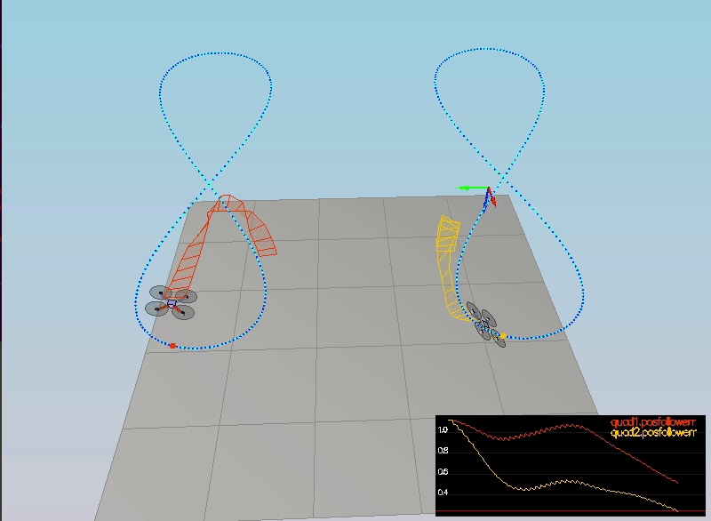
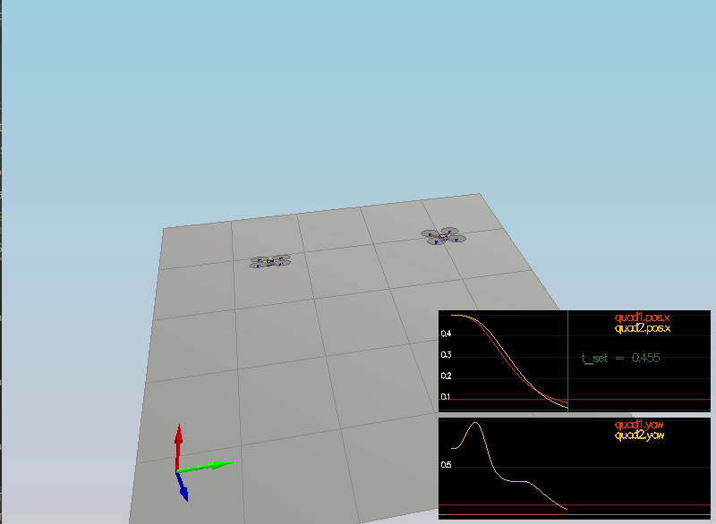
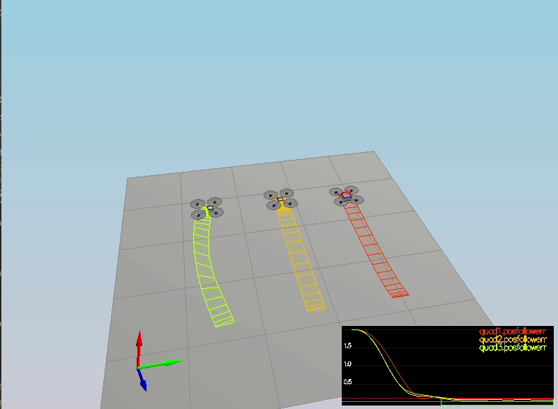

# Implementation steps

Below I have explained each tasks solution to reach this outcome:

### Task 1 Tunning of mass of drone (scenario 1) ###
After trial and error strategy, I figure it out that drone is stable around 0.495.  

### Task 2 Implemented body rate and roll/pitch control (scenario 2) ###
> To implement p controller of body rate and roll/pitch, I have taken help from *body_rate_control()* and *roll_pitch_controller()* functions of
> [Python controller code](https://github.com/udacity/FCND-Controls/blob/solution/controller.py), used the mathematical equations from exercise 4.2

- Code for BodyRateControl():
<pre><code>
    V3F MI{Ixx, Iyy, Izz};
    V3F rate_error = pqrCmd - pqr;

    //Only a P-controller
    momentCmd = MI * kpPQR * rate_error;
</code></pre>
- Code of RollPitchControl()

<pre><code>
    float c_d = collThrustCmd / mass;
    float b_x_c_dot = kpBank * (accelCmd[0] / c_d - R(0, 2));
    float b_y_c_dot = kpBank * (accelCmd[1] / c_d - R(1, 2));

    pqrCmd.x = (R(1, 0) * b_x_c_dot - R(0, 0) * b_y_c_dot) / R(2, 2);
    pqrCmd.y = (R(1, 1) * b_x_c_dot - R(0, 1) * b_y_c_dot) / R(2, 2);
    pqrCmd.z = 0.f;
</code></pre>

- Tunning of angle rate gain (kpPQR) is done and found stable outcome at 75, 80, 6.
- Same way angle control gains (kpBank) is tuned to 12.
> After the above implementation and tunning of paramters , we got below output:

### Position/velocity and yaw angle control (scenario 3) ###
> To implement lateral position control, I used PD-controller for drones in x-y equations explained in Exercise 4.1 and also taken help from *laternal-position_control()* used in 
>[Python controller code](https://github.com/udacity/FCND-Controls/blob/solution/controller.py). There are few changes done which are below:

<pre><code>
V3F pos_diff;
    pos_diff.x = kpPosXY * (posCmd.x - pos.x);
    pos_diff.y = kpPosXY * (posCmd.y - pos.y);

    // limit horizontal velocity
    float velCmd_norm = pow(pow(velCmd.x, 2) + pow(velCmd.y, 2), 0.5);
    if (velCmd_norm > maxSpeedXY) {
        velCmd.x = (velCmd.x * maxSpeedXY) / velCmd_norm;
        velCmd.y = (velCmd.y * maxSpeedXY) / velCmd_norm;
    }

    V3F vel_diff;
    vel_diff.x = kpVelXY * (velCmd.x - vel.x);
    vel_diff.y = kpVelXY * (velCmd.y - vel.y);

    accelCmd += pos_diff + vel_diff;

    // limit horizontal acceleration
    float accelCmd_norm = pow(pow(accelCmd.x, 2) + pow(accelCmd.y, 2), 0.5);
    
    if (accelCmd_norm > maxAccelXY) {
        accelCmd.x = (accelCmd.x * maxAccelXY) / accelCmd_norm;
        accelCmd.y = (accelCmd.y * maxAccelXY) / accelCmd_norm;
    }
</code></pre>

> To implement altitude controller, which is a PD controller of Drone for thrust needed to reach the target z-position and target velocity.
>For that I have used the formulas given in Exercise 5.3. Also the verticle acceleration is kept limitted to max accend and decend values.
> Below is the code for the same:
>
<pre><code>
float pos_err = posZCmd - posZ;
    float vel_err = velZCmd - velZ;

    float u_1_bar = (kpPosZ * pos_err) + (kpVelZ * vel_err) + accelZCmd;

    float verticle_acc = (u_1_bar - CONST_GRAVITY) / R(2, 2);

    // descent mode
    if (verticle_acc > (maxDescentRate / dt)) {
        verticle_acc = maxDescentRate / dt;
    }
    // ascent mode
    if (verticle_acc < (-maxAscentRate / dt)) {
        verticle_acc = -maxAscentRate / dt;
    }

    thrust = -mass * verticle_acc;
</code></pre> 

> To implement Yaw controller, which is a P-controller for drones yaw rate, I have used *yaw_control()* from 
> [Python controller code](https://github.com/udacity/FCND-Controls/blob/solution/controller.py) using the formulas given in exercise 5.2
>Code for yaw_control()
<pre><code>
    float yawError = yawCmd - yaw;
    yawError = fmodf(yawError, M_PI * 2.f);

    if (yawError > M_PI) {
        yawError -= 2.f * M_PI;
    } else if (yawError < -M_PI) {
        yawError += 2.f * M_PI;
    }
    yawRateCmd = kpYaw * yawError;
</code></pre>
> Furthermore, kpPosZ, kpVelXY, kpVelZ, KiposZ, kpYaw are tunned to pass all scenarios.
>Results after yaw tunning, 

### Non-idealities and robustness (scenario 4) ###
> In order to pass the scenario 4, integrator needs to be added to compensate bias by different masses.
> Drones motion after integrator tunning

### Motor commands implementation ###
> To calculate the motor commands, I have used the equations provided in the exercises for linear euation system with tau_x/y/z.
>Which are dependent on forces with arm lenths with kappa= k_m/k_f. Equations needs to be reshuffled to provide the correct forces to rotors.
> Code as per above explanation:

<pre>
<code>
    float c_bar = collThrustCmd;
    //calculate distance to axes
    float l = L / pow(2.f, 0.5);
    float p_bar = momentCmd.x / l;

    float q_bar = momentCmd.y / l;

    float r_bar = -momentCmd.z / kappa;

    cmd.desiredThrustsN[0] = (c_bar + p_bar + q_bar + r_bar) / 4.f; // front left
    cmd.desiredThrustsN[1] = (c_bar - p_bar + q_bar - r_bar) / 4.f; // front right
    cmd.desiredThrustsN[2] = (c_bar + p_bar - q_bar - r_bar) / 4.f; // rear left
    cmd.desiredThrustsN[3] = (c_bar - p_bar - q_bar + r_bar) / 4.f; // rear right
</code></pre>

