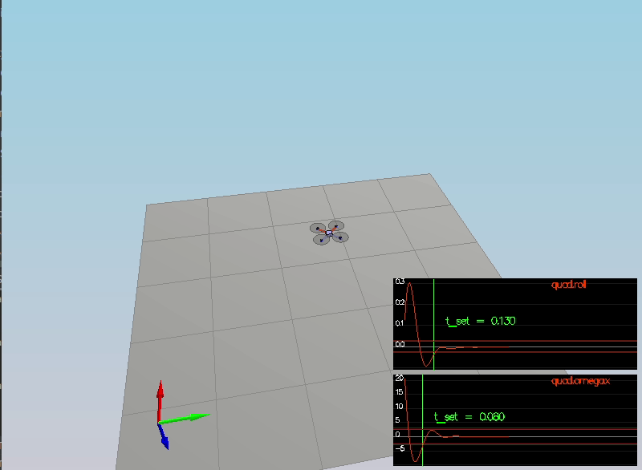

#Project steps explained 
Below I have explained each tasks solution.
### Task 1 Implemented body rate and roll/pitch control in C++ ###
>> To implement p controller of body rate and roll/pitch, I have taken help from *body_rate_control()* and *roll_pitch_controller()* functions of
> [Python controller code](https://github.com/udacity/FCND-Controls/blob/solution/controller.py)

- Code for GenerateMotorCommands(): 
<pre><code>
    float c_bar = collThrustCmd;
    //calculate distance to axes
    float l = L / pow(2.f,0.5);
    float p_bar = momentCmd.x / l;

    float q_bar = momentCmd.y / l;

    float r_bar = - momentCmd.z / kappa;

    cmd.desiredThrustsN[0] = (c_bar + p_bar + q_bar - r_bar)/4.f; // front left
    cmd.desiredThrustsN[1] = (c_bar - p_bar + q_bar + r_bar)/4.f; // front right
    cmd.desiredThrustsN[2] = (c_bar + p_bar - q_bar + r_bar)/4.f; // rear left
    cmd.desiredThrustsN[3] = (c_bar - p_bar - q_bar - r_bar)/4.f; // rear right
</code></pre>
- Code for BodyRateControl():
<pre><code>
    V3F MI{Ixx, Iyy, Izz};
    V3F rate_error = pqrCmd - pqr;

    //Only a P-controller
    momentCmd = MI * kpPQR * rate_error;
</code></pre>
- Code of RollPitchControl()

<pre><code>
    float c_d = collThrustCmd / mass;
    float b_x_c_dot = kpBank * (accelCmd[0] / c_d - R(0, 2));
    float b_y_c_dot = kpBank * (accelCmd[1] / c_d - R(1, 2));

    pqrCmd.x = (R(1, 0) * b_x_c_dot - R(0, 0) * b_y_c_dot) / R(2, 2);
    pqrCmd.y = (R(1, 1) * b_x_c_dot - R(0, 1) * b_y_c_dot) / R(2, 2);
    pqrCmd.z = 0.f;
</code></pre>

- Tunning of angle rate gain (kpPQR) is done and found stable outcome at 75, 80, 6.
- Same way angle control gains (kpBank) is tuned to 12.
> After the above implementation and tunning of paramters , we got below output:

